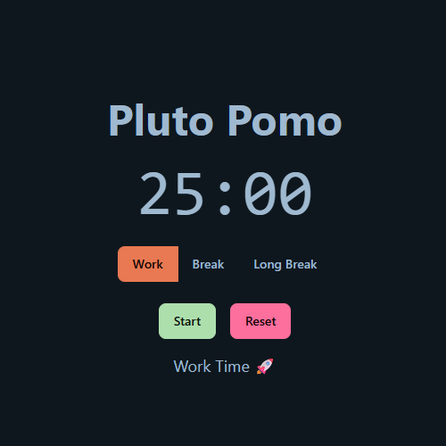

# 🪐 Pluto Pomo


A beautiful, cross-platform **Pomodoro Timer** built with **Vite**, **React**, **Tailwind CSS**, and **DaisyUI** — designed to help you stay focused and manage your time with elegance.

[](https://jshabun.com/pomo)

---

## 🚀 Features

- ⏱️ Customizable Pomodoro, Break, and Long Break durations  
- 🔄 Manual mode switching (Work / Break / Long Break)  
- 🔔 Sound alerts on session completion (plays 3 times)  
- 🔇 Mute/unmute toggle  
- ⚙️ Settings modal for live configuration  
- 🌙 Dark mode support (via DaisyUI themes)  
- 📱 Responsive design for desktop & mobile  
- ⚡ Blazing fast with Vite and React  
- 🛠️ Easily deployable to GitHub Pages or any static host

---

## 🧪 Tech Stack

- [React](https://reactjs.org/)
- [Vite](https://vitejs.dev/)
- [Tailwind CSS v4](https://tailwindcss.com/)
- [DaisyUI](https://daisyui.com/)
- TypeScript

---

## 🎨 Screenshots

| Work Mode | Break Mode |
|-----------|------------|
|  |  |

---

## 🛠️ Getting Started

### 1. Clone the repo
```bash
git clone https://github.com/yourusername/pluto-pomodoro.git
cd pluto-pomodoro
```

### 2. Install dependencies
```bash
npm install
```

### 3. Start the development server
```bash
npm run dev
```
> [!Note] The output should look like:
```bash
VITE vX.Y.Z ready in XXX ms
➜ Local: http://localhost:5173/
➜ Network: http://your_ip_address:5173/
➜ press h to show help
```
> [!Note] Modify the following files as needed
```ts
// Main Logic
App.tsx

// Additional Styling
index.css
```

### 4. Build the project
```bash
npm run build
```
> [!Note] The output should like:
```bash
✓ built in XXXms
dist/index.html   (and other optimized assets)
```
